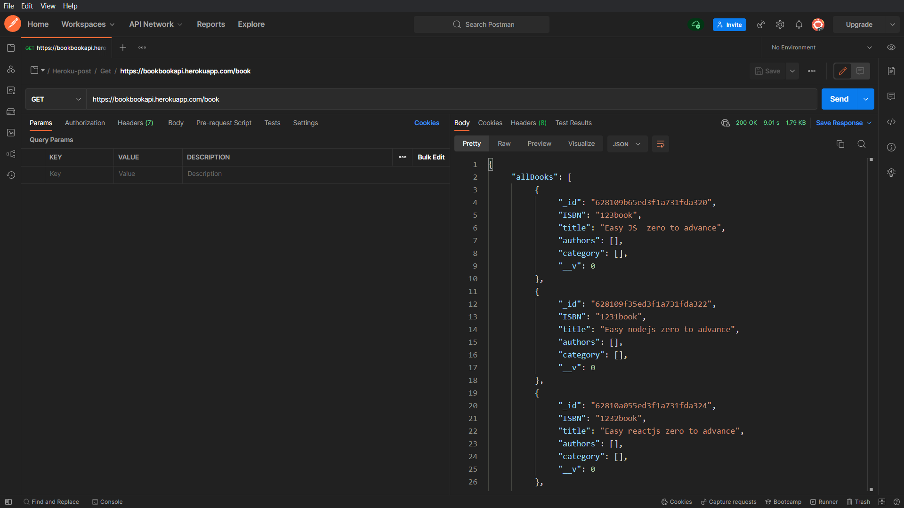
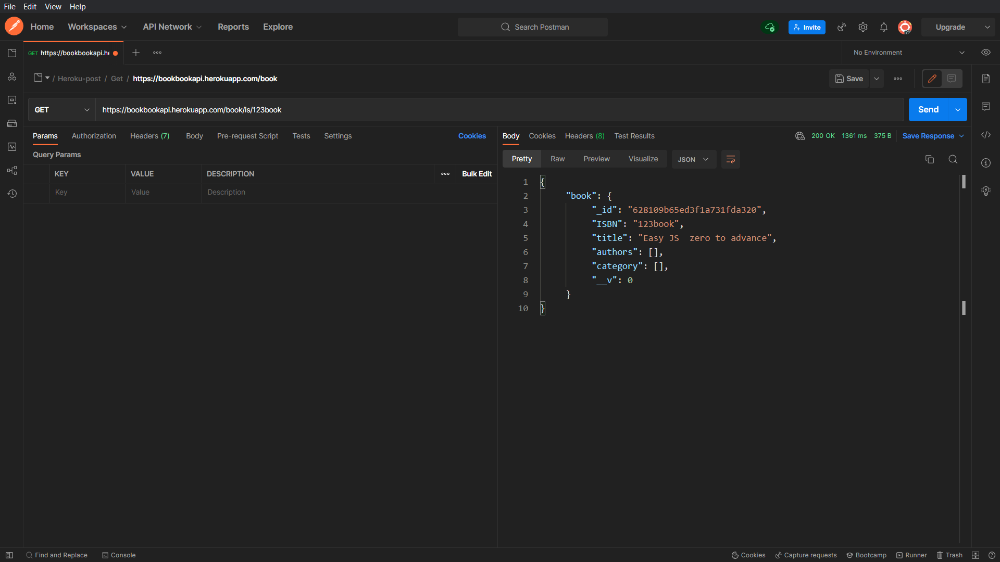
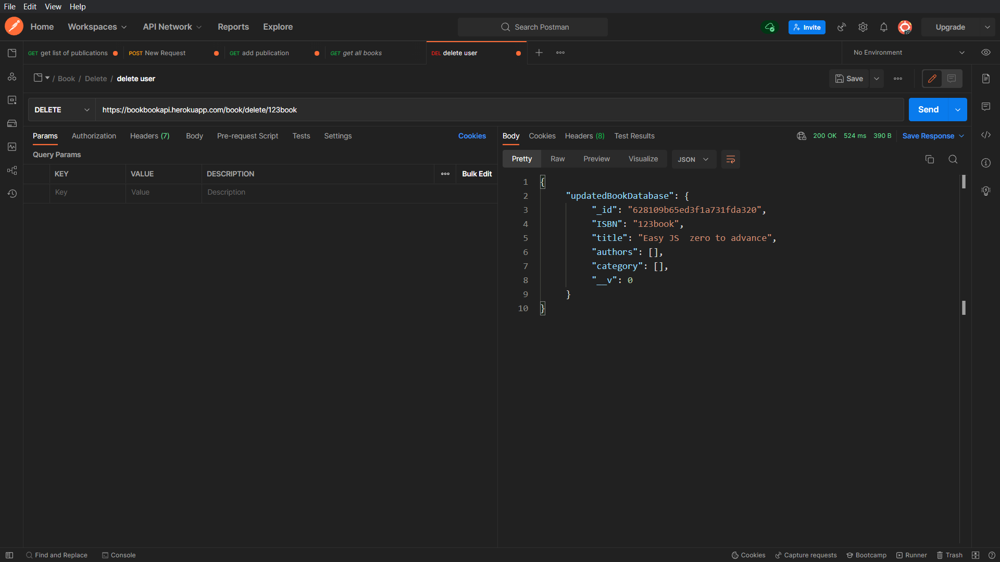
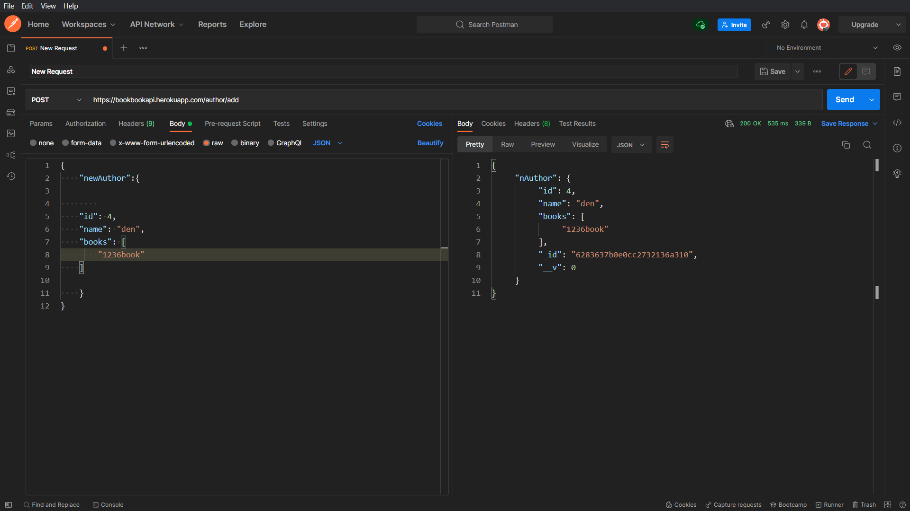
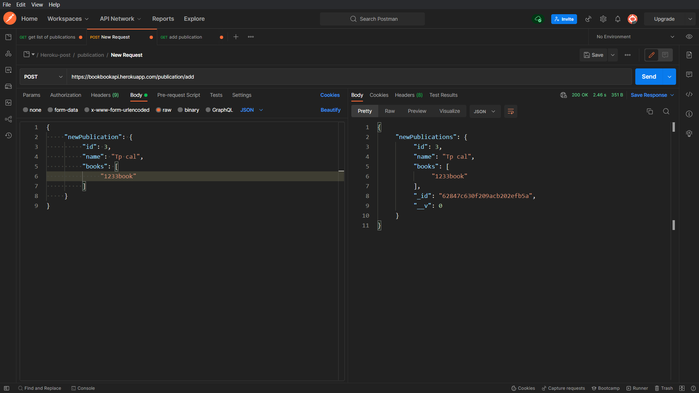

# Book API

```Book api using nodejs,express and Mongodb (Mcro-server).```

<br><br>
# How to use this API.


i> how to add book :


ii> how to get all books :




iii> how to get specific book : 
<br>
`note :
     123book is a ISBN number.`




# Similar : 
iv> get book based on Price  :
https://bookbookapi.herokuapp.com/book/price/200

here: 200 is price.

v> get book based on category :

https://bookbookapi.herokuapp.com/book/c/programming

here : programming is parameter.

vi> Delete :

delete book :
https://bookbookapi.herokuapp.com/book/delete/123book

here : 123book is isbn number of book



## Author :

i> Add author :



ii> Get all author by id : 


# Publication

i> Add Publication :
     



## command to run server  : 
" npx nodemon index "

## This is some package that I've used  :

```
1> Install init.

2> Install express version 8.1.3,
    express: 4.17.2
    "npm install express".

3> Install nodemone  (nodemon: 2.0.15).


4> Install dotenv(dotenv : 10.0.0).
    npm i dotenv
    

5> Install Mongoose (mongoose: 6.1.5)
    npm i mongoose
    
```