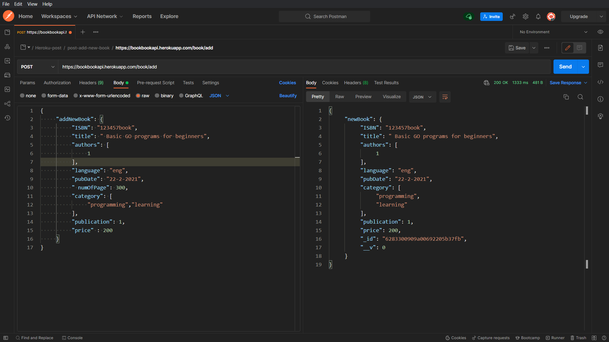

# Book API

```Book api using nodejs,express and Mongodb (Mcro-server).```

<br><br>
# How to use this API.


1> how to add book :




```
1> Install init.

2> Install express version 8.1.3,
    express: 4.17.2
    "npm install express".

3> Install nodemone  (nodemon: 2.0.15).

4>command to run server  "npx nodemon index".

5> Install dotenv(dotenv : 10.0.0).
    npm i dotenv
    

6> Install Mongoose (mongoose: 6.1.5)
    npm i mongoose
    
```